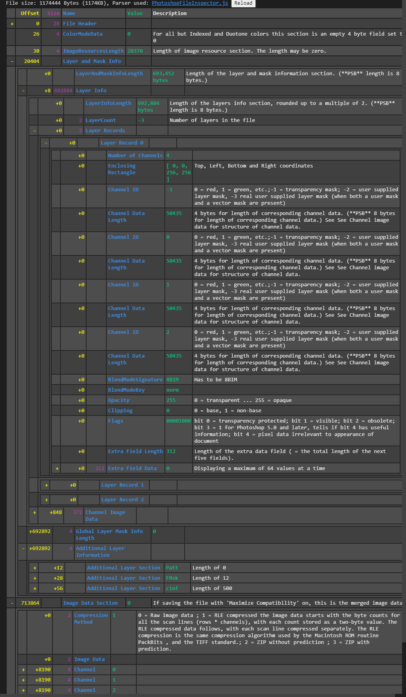

# Photoshop File Inspector

A parser for the VSCode extension [Binary File Viewer](https://github.com/maziac/binary-file-viewer) to visually inspect and verify photoshop PSD and PSB binary files.

> Preview of a parsed Photoshop File with collapsible sections

## Installation

To install the parser, download the git repo and follow the [instructions](https://github.com/maziac/binary-file-viewer/blob/main/assets/local/help/help.md#parser-path) for registering a parser with Binary File Viewer and point it to the `./src` directory. After having registered the parser, you should be able to open *.psd and *.psb files directly from Visual Studio Code.

## Usage

This parser provides a view into the binary file making it human readable. It makes no assumptions about what the data is supposed to represent. Therefore, it wont fail to parse the file if the data is not according to the specification (e.g. if Photoshop expects '8BIM' as Signature, it will keep parsing even if this is not the case).

The intended use case is for people writing photoshop file format parsers to verify if their tools process and write the files correctly and to easily debug potential issues.

The parser tries to read the files in sections with memory offsets for each one to avoid corrupt sections making the rest of the data unreadable. It uses the length markers at the start of each section to make these assumptions.

## Limitations

- Any errors with the actual photoshop file itself do not get handled as this is not within the scope of the project.
- There is currently very limited support for parsing of the **Image Resources Section**.
- Extra Data held at the end of each layer record instance is only provided as memory dump and not actually parsed

## References

As the Photoshop File Format specification is unfortunately incomplete and in parts incorrect, some other parsers were used to verify and correct it.

- [Photoshop File Format Specification](https://www.adobe.com/devnet-apps/photoshop/fileformatashtml/)
- [psd_sdk](https://github.com/MolecularMatters/psd_sdk)
- [pytoshop](https://github.com/mdboom/pytoshop)